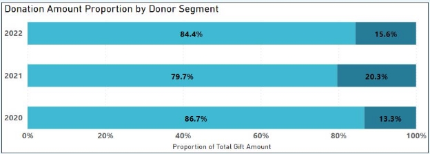
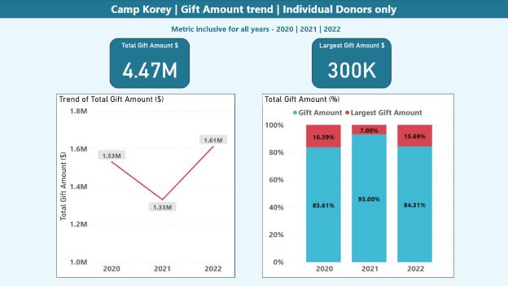
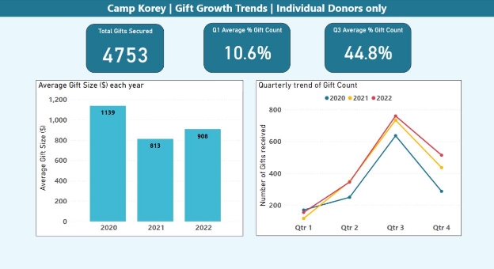
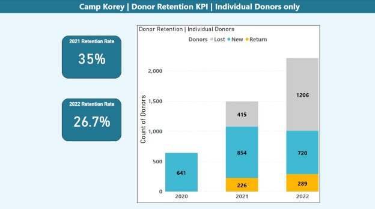

**DONOR DATABASE ANALYSIS AND RECOMMENDATIONS** 

**MSDS 23.1             Seattle University, 2023** 

**Team Members** 

Liya LaPierre, Karthika Selvaraj, Aishwarya Saibewar, and Radhika Magaji 

**Faculty Advisor** Dr. Ariana Mendible 

**Sponsors** Camp Korey 

*2023 Capstone Project Report    MSDS Team 23.1![ref1]*

**Contents** 

1. [Abstract ...................................................................................................................................................... 2](#_page2_x69.00_y72.00)
2. [Introduction ............................................................................................................................................... 2](#_page2_x69.00_y264.00)
1. [About Camp Korey ............................................................................................................................... 2](#_page2_x69.00_y290.00)
1. [Problem ................................................................................................................................................ 3](#_page3_x69.00_y141.00)
1. [Solution requirements ......................................................................................................................... 3](#_page3_x69.00_y487.00)
3. [Our Data ..................................................................................................................................................... 4](#_page4_x69.00_y181.00)
4. [Methods and Results ................................................................................................................................. 4](#_page4_x69.00_y511.00)
1. [Data cleaning ....................................................................................................................................... 4](#_page4_x69.00_y537.00)
1. [Invalid donor contact information....................................................................................................... 5](#_page5_x69.00_y181.00)
1. [Donor segmentation ............................................................................................................................ 5](#_page5_x69.00_y370.00)
4. [Donation giving timelines .................................................................................................................... 6](#_page6_x69.00_y618.00)
4. [Donor retention ................................................................................................................................... 8](#_page8_x69.00_y500.00)
4. [Donor engagement score .................................................................................................................... 9](#_page9_x69.00_y393.00)
4. [Machine learning models to predict donation score ........................................................................ 10](#_page10_x69.00_y183.00)
5. [Conclusion ................................................................................................................................................ 12](#_page12_x69.00_y72.00)
1. **Abstract** 

` `As a non-profit organization providing free of cost camp programs to children with severe medical conditions, Camp Korey depends on donors and volunteers to support their programs. However, they struggle with missing or incorrect contact information for their donors and a lack of data-driven insights into their donors. We have worked with their data to identify the donors with invalid addresses and emails, used Microsoft Power BI to visualize trends in the data, and developed a methodology for Camp Korey to score each donor's engagement. By improving the quality of their data and providing insights into their donor base, this work will help Camp Korey develop more informed and effective fundraising strategies. 

2. **Introduction** 
1. ***About Camp Korey*** 

Camp Korey is a non-profit organization that works for the empowerment of children with a wide range of life-altering medical conditions. Tim Rose founded Camp Korey in 2005 after his teenage son Korey died from bone cancer at the young age of eighteen. The organization’s purpose is to provide a fun and safe environment for children with serious illnesses. Camp Korey conducts many kinds of programs throughout the year that are completely free for the children and their family, all geared towards helping them to build a support group and enjoy themselves.  

Some of the programs that they offer are a summer camp, family weekends, “Camp To You”, and BLOCK program. The Summer Camp program is a camp for these children who have serious medical conditions while still allowing them access to specialized medical support. Every summer, several weeks of camps are hosted on Camp Korey’s 200-acre property in Mount Vernon, WA. The Family Weekend program is a similar, condition specific program open to every family to join in on the camp fun throughout the year. The BLOCK program which is also known as “building leaders out of Camp Korey” is offered to teen campers aged 16 & 17, and focuses on leadership, projects that build skills, and other programming like give-back projects and job shadowing. And finally, the “Camp To You” program brings the fun of Camp Korey’s summer camp program to children that are in hospitals in the Seattle, Tacoma, and Portland areas. This is aimed at enhancing the quality of life for the children and families that need to spend long, stressful hours in hospitals.  

Because Camp Korey offers all of these programs at no cost to the families of these children, they depend on the contributions of donors and volunteers. Camp Korey has many options for donor involvement: you can donate money directly, donate items, start a fundraiser, or just volunteer to help out. Camp Korey keeps track of the people that have gotten involved in the past, and therefore might be willing to help in the future. 

2. ***Problem*** 

While they do keep track of people that have been involved in their organization, the leadership at Camp Korey feel that they are not making the most of their donor database. They have identified several issues with their data: 1) incorrect contact information for donors, 2) lack of insights into donors and giving timelines, and 3) inability to evaluate engagement with the organization.  

Camp Korey currently has some systems in place to ensure their donor database is up to date. The organization sends out surveys frequently to update donor contact information, and they have a tool for automatically updating the phone numbers and addresses in their system. However, this may not capture all changes, and there are some donors who are missing this information altogether. Unfortunately, Camp Korey’s system cannot easily identify those individuals who may need updated information.  

They would also like to use their data to gain a better understanding of their donor base and improve the efficacy of their fundraising campaigns. At this point, they have not done any significant analysis of their donors or giving trends. Finally, Camp Korey expressed that they would like a way to measure how engaged a person is with the organization. While other non-profit organizations have systems that do automatic scoring and analyses of engagement, Camp Korey does not currently have that capability.  

3. ***Solution requirements*** 

With respect to the issue of invalid data, Camp Korey would like a list of donors that have invalid email addresses and a list of donors with invalid addresses. This list would allow Camp Korey’s staff to more easily make efforts to get this information updated. To help them do this more effectively, they also need the donors to be in the order of most to least donated amounts, allowing them to focus on updating contact information for their biggest donors.  

In terms of the donor and giving analyses, Camp Korey wanted to explore primarily individual donors (as opposed to corporations) and gifts between 2020 and 2022. They also hoped to segment their donors by annual giving amount, with the cutoff being $2500 between “small” donors and “big” donors.  

Finally, Camp Korey needs the engagement score measurement to take into account both donation and volunteer activity. They identified several important variables they felt were a good representation of engagement with their organization. With regards to donations, several variables were identified as possible measures of engagement including total donation amount, donation frequency, event donation, last donation recency, and years consecutively donated. Similarly, for volunteer activity they identified total hours volunteered and number of times volunteered as important measures of engagement. 

3. **Our Data** 

Camp Korey has their donor data stored in Raiser’s Edge, which is a Constituent Relationship Management (CRM) software designed specifically for non-profits. The software allows for data to be extracted in the form of excel spreadsheets. Below mentioned are the three main datasets along with their description that were extracted and provided for further analysis.   

||Dataset |Description |
| :- | - | - |
|1\. |Biographical Donor data |Constituent ID, name, type, contact information – email, mailing address, phone number, age. |
|2\. |All Gifts data |Gift ID, Gift Date, Constituent ID, name, Donation Type, Fund, Campaign, Appeal |
|3\. |Volunteer data |Volunteer ID, Volunteer name, Date, Job assignment, Volunteer Position, Hours. |

*Table 1: Dataset and information contained.* 

The datasets contain information for all donor types, but the analysis was limited to include only those marked as an “Individual” donor (a single person rather than a corporation or other type of donor). There were a few discrepancies in dataset such as duplicate Constituent IDs, de-normalized columns, and a few mislabeled donor types which were cleaned using python and SQL queries. 

4. **Methods and Results** 
1. ***Data cleaning***  

The primary email was initially spread across 12 columns in the dataset. To organize the data efficiently, the scattered information was consolidated into a single column which would help in understanding whether a donor has a primary email address or not. Similarly, the donor's contact preference is described via solicit codes such as “don't mail", "invalid email", "don't email", and "don't call" in the dataset. It was entered across 5 columns arbitrarily. New columns were created for different solicit codes with a TRUE or FALSE flag. This was helpful in identifying invalid donor contact information. With regards to donor type, the code was updated from “Individual” to “Corporate” for the donors whose first and last names are missing in the dataset, as recommended by Camp Korey. 

As "Donor Id" is the primary key across all the tables, it should not be blank. Therefore, a unique identifier value was generated for the blank entries. There were also many instances where the same donor (matching name and other information) had multiple IDs. The duplicate entries for donors having the same information across all columns were removed from the dataset. Then, any gifts or volunteer activity linked to the deleted entries were updated.  

2. ***Invalid donor contact information***  

Once the data was cleaned, we imported the three cleaned datasets into a MySQL database. We were then able to create SQL queries to identify donors with invalid contact information. First, we identified donors which had been marked as having an invalid mailing address, which was a field originally provided by Camp Korey. Then, we identified donors who were indicated as having an invalid email address. This information was contained in a field that we had calculated during the data cleaning process using the solicit code fields in the original data. Then, for both of these lists of donors, we ordered the results in descending order based on the total amount given by that donor. These results were saved to Excel files and provided to Camp Korey.  

3. ***Donor segmentation*** 

Donor segmentation into subgroups was done based on the annual giving amount of each donor. These were divided into two subgroups - *Large* amount donors and *Small* amount donors, whose specifications are shown in *Table 2.* 

|**Subgroup** |**Annual giving amount ($)** |
| - | - |
|Large amount donors (Level1) |$2500 and above |
|Small amount donors (Level2) |Below $2500 |

*Table 2: Donor Segmentation subgroups* 

SQL queries were created to determine the donor levels and the results were subsequently visualized in Microsoft PowerBI. Figure 1 shows a chart of the proportion of donors by segments. The percentage of donors for level 1, or “large” donors, has consistently been smaller for all three years; less than 10% of all donors. A major portion of the donor base falls under the level2 subgroup; more than 90% of all donors were considered “small” donors. Figure 2 shows the proportion of donations by level. Even though there are much fewer large amount donors (level 1) compared with small amount donors (level 2), they donate a much larger proportion of Camp Korey’s total gifts. This trend has been consistent for all three years. This insight can be helpful to Camp Korey in planning their fundraising efforts around specific subgroups. 

*Figure 1. Proportion of Donor Segments* 

*Figure 2. Donation Amount Proportion by segments* 

4. ***Donation giving timelines*** 

Donation timelines were explored for the Individual donors over the last three years, and it was found that the total amount donated was 4.47 million dollars. The line chart on bottom left shows the trend in total gift amount over the years, and a dip can be observed in the year 2021. This could have been due to the pandemic which may have had an impact on fundraising efforts. The chart on right shows the percentage of largest gift amount in relation to the total gift amount received. It is useful to track the trend of this metric as it can help Camp Korey identify donor behavior and adjust its fundraising strategies accordingly. The chart shows that about 7-17% of the total donation amount comes from a single large donation. Identifying the individuals making these large donations could be a potential source of referrals or introductions to other potential donors, eventually benefiting the organization to expand the donor base. 

*Figure 3: Dashboard for Gift Amount Trends* 

Figure 4 below shows a dashboard on gift growth trends over the last three years from individual donors. The figure on bottom left describes the trend of average gift size received each year. The average gift size is the average donation amount given by individuals each year. This metric is useful in understanding the donor behavior, and in evaluating the success of Camp Korey’s fund-raising efforts, year after year. This trend seems synonymous with the total amount each year; dip in 2021. 

Average gift size = Total amount of donations received ÷ Number of Gifts Received 

*Figure 4: Dashboard for Gift Growth trend*  

The figure on bottom right describes the trend of number of gifts received over the quarter for the last three years. The chart clearly indicates a greater number of gifts being received around quarter 3 of the year followed by quarter 4. This trend has been consistent throughout three years. This could mean Camp Korey’s fundraising efforts are more around the summer months as they conduct various camp programs in that season.  

5. ***Donor retention*** 

Figure 5 shows the organization’s donor growth using a performance measure to evaluate how many donors continue to donate to the organization since their first contribution. The donors are classified into three categories as new donors, returning donors from the previous year, and donors from the previous year that have not contributed (lost donors). Our analysis began with the data retrieved from the year 2020, keeping in mind that all the donors listed for this year were the existing donors. There were 323 donors from the year 2020, who came back to contribute for the year 2021. Apart from this there were 974 new donors. Highlighted in blue are the 544 donors from the previous year that haven't contributed. The donor retention rate for 2021 is 35%. Similarly, for 2022 the donor retention rate is 26.7%. 

*Figure 5: Donor Retention KPI* 

6. ***Donor engagement score***  

To measure how engaged each person is across both volunteering and donation categories, we performed a series of calculations based on a person’s volunteer and donation activities throughout 2020-2022 to determine their score. As both donation and volunteering were considered for the analysis, the calculation for the total engagement score were done in two parts: the calculation of the donation score and the calculation of the volunteering score. 

The variables that were considered for each donor’s Donation Score were their total amount donated, number of gifts donated, whether or not they gave at an event, number of days since the last donation, and whether they donated for the last 2 years. Similarly, the variables considered for the Volunteering Score calculation were the total number of hours volunteered and the number of times they volunteered. We consulted with Camp Korey to determine which of these variables were considered the most important to how they perceive engagement. Weights were then assigned to each attribute based on their importance to Camp Korey, and the Donation and Volunteering scores are calculated. 

**Donation Score** = 0.2\*(Special Events) + 0.3\*(Total Donation) + 0.2\*(Frequency of donations) + 0.2\*(Recency) + 0.1\*(Donated in the last two years) 

**Volunteering score** = 0.4\*(Frequency of volunteering) + 0.6\*(Total hours volunteered) 

Then the Engagement Score for each individual was calculated by assigning equal weights to the Donation Score and Volunteering Score.  

**Engagement Score** = 0.5\*(Donation Score) + 0.5\*(Volunteering Score) 

7. ***Machine learning models to predict donation score*** 

Once the engagement scores were calculated, we developed machine learning models to predict each donor’s donation score using their past donation activity. The models were trained to predict their donation score for 2020 to 2022 using their 2018 and 2019 data. The first model used was a random forest regression model.*** 

Random forest regression is a machine learning algorithm that builds multiple decision trees with a subset of feature variables and averages their predictions to make more accurate predictions. It identifies the most important features in your data set and makes predictions. The features (variables we are using to predict) we used in the model were total donation amount, frequency and recency of donations, whether the donation has come from a special event, and the consistency of donation for the last 2 years. These were all calculated in SQL looking at donation activity between 2018 and 2019. The target variable (variable we are predicting) is the donation score calculated for the years 2020 –2022. The model was trained to produce decision trees using subset of 3 feature variables and set to create 500 trees. The measure of the model’s performance in mean squared error rate is 3.7, meaning the root mean squared error was 1.93. This means that out of 10 points possible on a donation score, our model was off by 1.93 points on average.***  

As you can see in Figure 6 below, a donor’s total donation amount in 2018-2019 was the most important predictor of their 2020-2022 donation score. The next most important variables, in order, were donation recency, frequency, donation at an event, and donated consecutively for 2 years.***  

*Figure 6: Random Forest Variable Importance* 

The Neural Network model is inspired by the structure and function of the human brain. It is composed of layers of interconnected nodes that perform computations on input data to produce an output. Each node or neuron takes in input from other neurons and applies an activation function to produce an output, which is then passed on to the next layer of neurons. The features we used for the neural network model were the same as in the Random Forest Regression model, but the input variables were scaled to have a similar range of values for all the variables. The model is built with 3 dense layers with 64, 32, and 16 nodes respectively, and 1 output node. To determine how well it was performing, the model was trained using a selection of data (training data) and evaluated with a separate set of test data. The mean squared error for this model was 4.6, with a root mean squared error of 2.14. This means our model was off by 2.14 points, on average, out of 10 points possible. Comparing this with the Random Forest model, we can see that the Random Forest model was more accurate with its predictions. It is also more understandable how the algorithm is making its decisions, so we ultimately decided that the Random Forest model would be a better choice.  

5. **Conclusion** 

Several elements of the work we did for Camp Korey can be used to help with improved efficiency and efficacy of fundraising. By identifying the donors who have invalid addresses and emails, Camp Korey can start to work on updating their records, improving their ability to retain donors year after year. The analyses and visualizations of donor segments and giving timelines will allow for Camp Korey to develop fundraising strategies based on the observed trends. The calculated donor engagement scores will allow them to assess how engaged each donor is currently, and the machine learning models provide the ability to predict future engagement as well. This project presents an opportunity for Camp Korey to make the most out of their data and improve fundraising efforts, ultimately allowing them to better serve the children and families they support. 
12   ![ref1]

[ref1]: Aspose.Words.ad4257f5-16b0-483a-9e85-57967ef76f87.004.png
